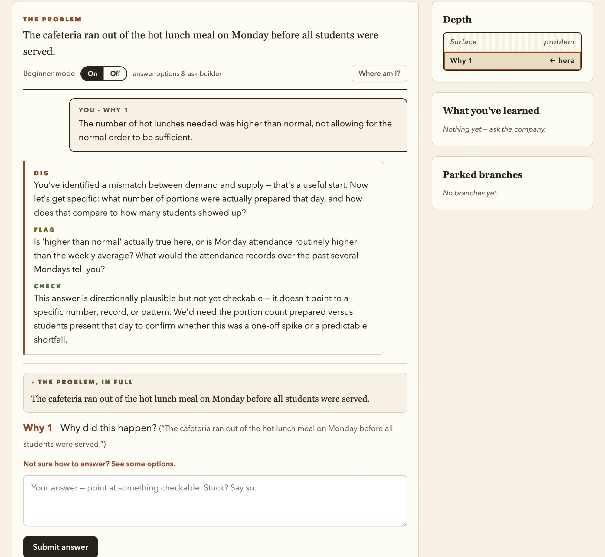
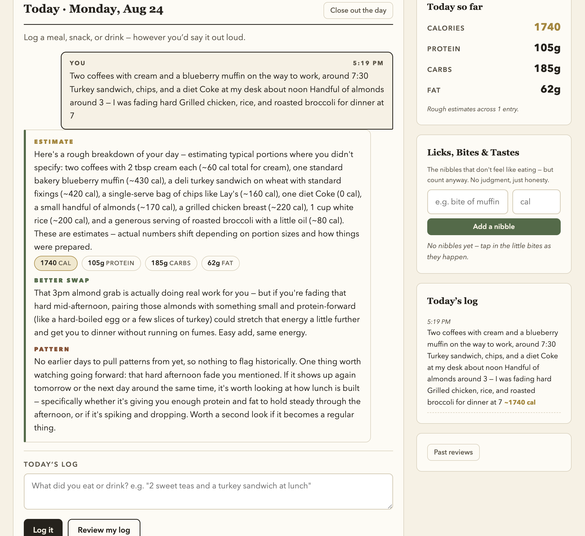
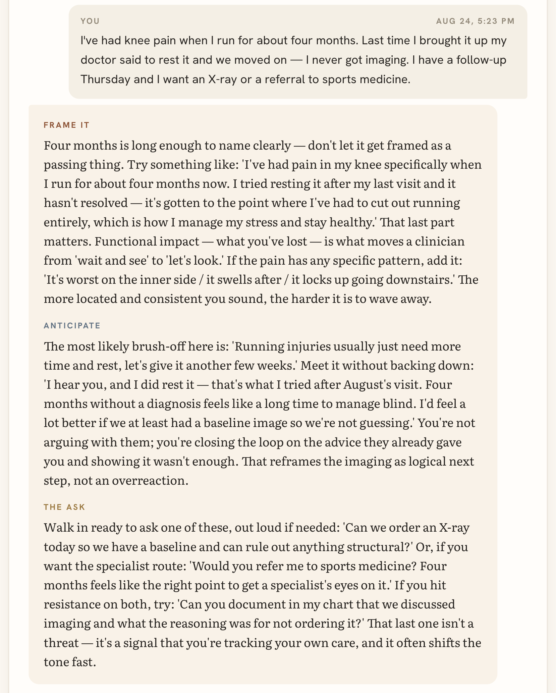
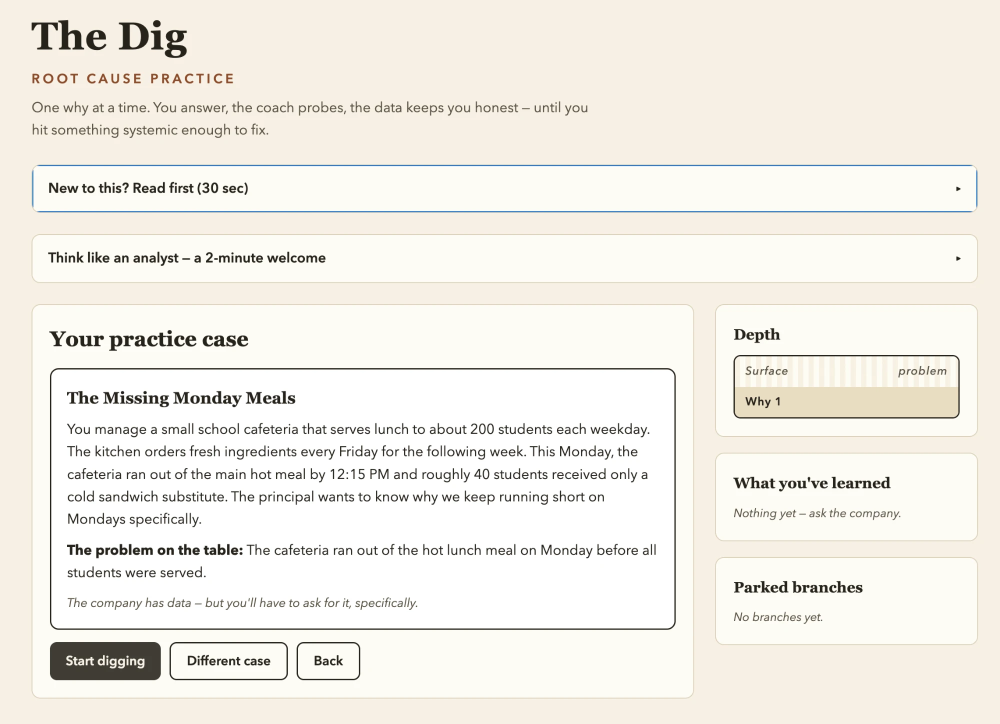
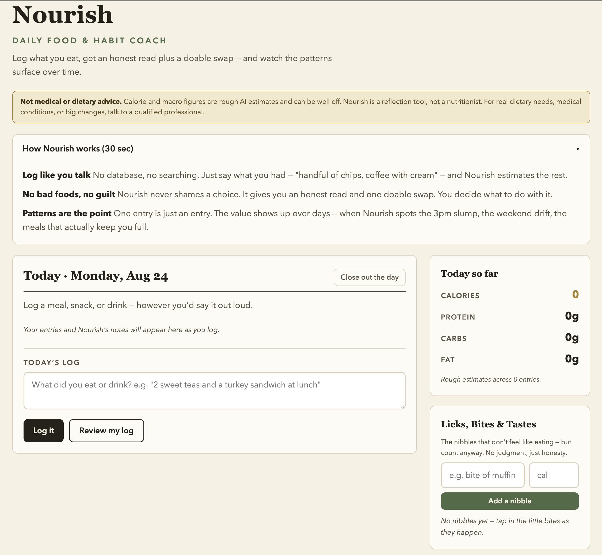
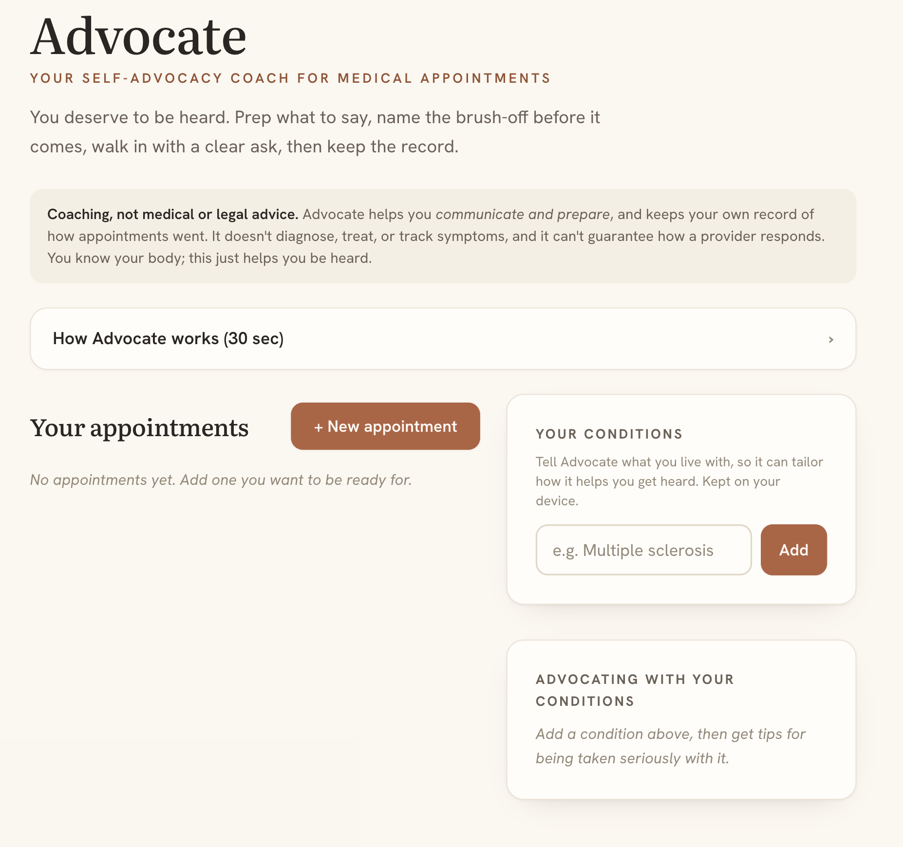
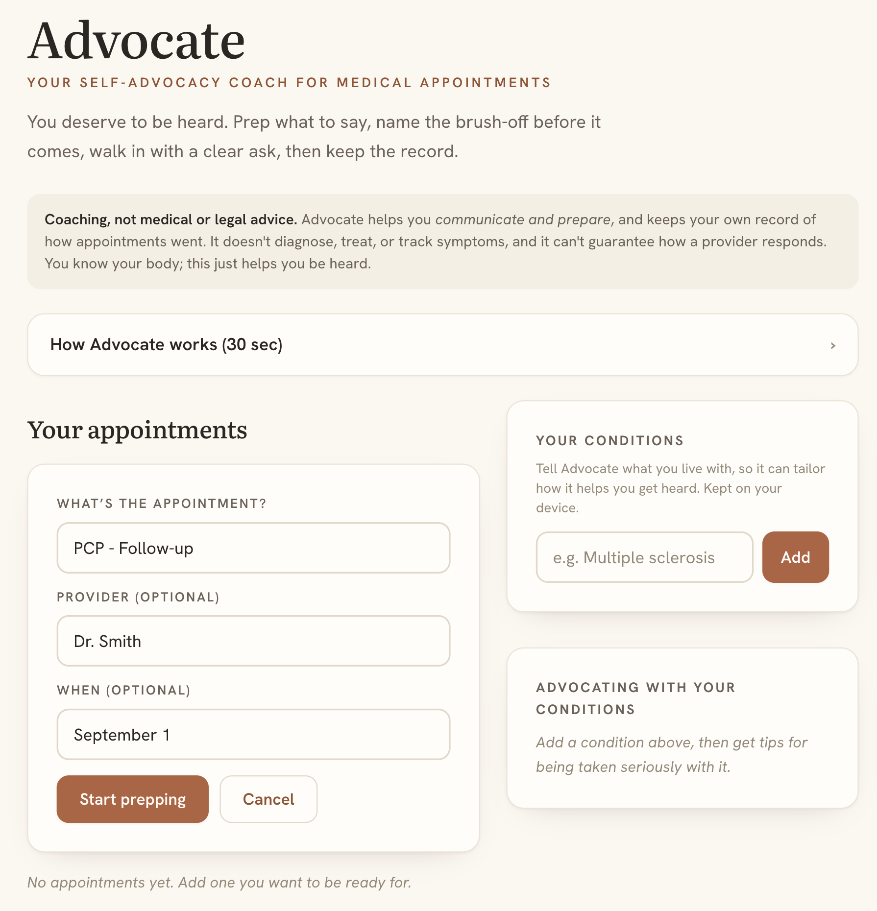

<div align="center">

# 🧭 Coach Engine

### One foundation. Every coach is a config file.

*The domain-agnostic core behind The Dig and Nourish, extracted into a template you can fork to spin up a new AI coach in an afternoon.*



</div>

---

## The idea

Every coach shares one rhythm:

> **📝 Log an entry** &nbsp;→&nbsp; **🧭 Coach responds** in the parts you define &nbsp;→&nbsp; *(over a stretch)* &nbsp;→&nbsp; **🔍 Review** &nbsp;·&nbsp; patterns, working, focus &nbsp;→&nbsp; **🔁 Follow-up** &nbsp;·&nbsp; did it stick?

The **engine** owns that rhythm. A **coach** just supplies its own words. So the core (`engine`, `ui`, `storage`, `coach`) never changes, and a new coach lives entirely in **one config file**.

```
src/
├── core/                  ← the engine — never edit this
│   ├── engine.js            the loop: entries, review, follow-ups
│   ├── coach.js             Claude calls, JSON parsing, prompt filling
│   ├── storage.js           localStorage, archive, graceful degradation
│   └── ui.js                renders everything from config + state
├── styles/base.css        ← shared design tokens
├── config/
│   └── example.coach.js   ← 👈 THE ONLY FILE YOU EDIT
└── main.js                ← points at one config
```

## Same engine, three coaches

Every screen below is rendered by the **same four core files**. The only difference is the config each one boots with — its voice, its prompts, and the `parts` it asks the model to return.

<div align="center">
<table>
<tr>
<td width="33%" valign="top"></td>
<td width="33%" valign="top"></td>
<td width="33%" valign="top"></td>
</tr>
<tr>
<td align="center"><b>The Dig</b><br><sub><code>dig · flag · check</code></sub></td>
<td align="center"><b>Nourish</b><br><sub><code>estimate · swap · pattern</code></sub></td>
<td align="center"><b>Advocate</b><br><sub><code>frame · anticipate · ask</code></sub></td>
</tr>
</table>
</div>

Three domains, three vocabularies, zero changes to the core. That is the whole idea.

## Make a new coach in 3 steps

1. **Copy the config.** Duplicate `src/config/example.coach.js` → `src/config/your-coach.js`.
2. **Fill in the blanks.** Identity, the coach's voice, your response `parts`, and the four prompts (entry / review / follow-up). Every field is commented.
3. **Point at it.** In `src/main.js`, change one line:
   ```js
   import config from './config/your-coach.js'
   ```

That's it. The engine renders your coach, remembers entries, runs reviews, and tracks follow-ups, all from what you wrote in that one file.

## What a config controls

| Field | What it does |
|---|---|
| `name` · `subtitle` · `tagline` | Identity + the storage key |
| `disclaimer` | The HTML notice up top (or `''` to hide) |
| `coachVoice` | The persona injected into every prompt |
| `parts` | The response parts, in order (`{ key, label }`) |
| `entryPrompt` | Per-entry coaching. Placeholders: `{coachVoice} {entry} {todayLog} {history}` |
| `reviewPrompt` | The stretch review. Returns `patterns · working · focus` |
| `followUpPrompt` | The "did it stick?" reaction. Returns `verdict · reaction` |
| `readFirstPrinciples` | The 30-second "how this works" intro |

The only rule: your `entryPrompt` must return **raw JSON whose keys match your `parts`**.

<details>
<summary><b>See each coach's opening screen</b> — identity, disclaimer, and read-first, all from config</summary>

<br>

<div align="center">
<table>
<tr>
<td width="33%" valign="top"></td>
<td width="33%" valign="top"></td>
<td width="33%" valign="top"></td>
</tr>
<tr>
<td align="center"><b>The Dig</b></td>
<td align="center"><b>Nourish</b></td>
<td align="center"><b>Advocate</b></td>
</tr>
</table>
</div>

Note the disclaimers: each is just the `disclaimer` string in that coach's config, and setting it to `''` hides the block entirely.

Advocate adds one step of its own before any coaching happens — you name the appointment you want to be ready for, and everything after that is scoped to it:

<div align="center">

</div>

</details>

## Run it locally

**Prerequisites:** Node 18+ and an Anthropic API key.

```bash
npm install
cp .env.example .env.local     # then paste your key into .env.local
npm run dev
```

The dev server proxies API calls and attaches your key **server-side**, so it never reaches the browser. (For production, put that call behind your own serverless function instead of the dev proxy.)

## Coaches built on this engine

- **The Dig** — root-cause practice for analysts (5 Whys, evidence-grounded)
- **Nourish** — a daily food & habit coach
- **Advocate** — a self-advocacy coach for medical appointments
- *…yours next.*

## License

MIT — see [LICENSE](LICENSE). Fork it, build your coach, ship it.

---

<div align="center">

*Designed & created by Misti Lantz · &copy; MindXpansion, LLC*

</div>
